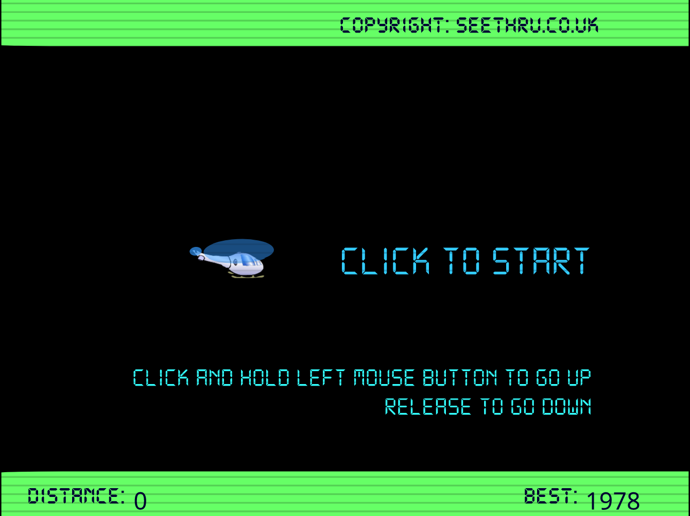

# The Helicopter Game

This is my version of the classic Helicopter Game.  
My version is built using HTML, CSS, HTML Canvas, and JavaScript.  
The object of the game is to fly the helicopter without crashing into obstacles along the path.  
The game is controlled using the left mouse button.  
It can be played by 1 or 2 players, and each player scores points based on the distance they fly the helicopter without crashing into an obstacle.  
Each player has 3 lives and the player with the highest score wins.  

[Click here to see a video of the original game](https://www.youtube.com/watch?v=v7xjPxV4kd4)

## Play game

Visit my GitHub pages to view the game in the browser:
[https://kathleenmerc.github.io/helicopter-game/](https://kathleenmerc.github.io/helicopter-game/)

## Features differing from the original game

- 1 or 2 player functionality
- Included buttons to direct user play
- Added an Instructions screen
- Each player has 3 lives
- The winning score is calculated between all scores in each round

## Features to work on 

- Player customization for players to input their name and choose the color of their helicopter
- Add gravity and acceleration to the helicopter
- Include sound effects

## Resources

I referred to Colin Veldkamp's starter code to help me organize and begin coding my game.  
[Colin Veldkamp's link to starter code](https://github.com/mrveldkamp-startcode/helicopter-game-start)   

## Shoutouts

Shout out to my brother and cousins, who would play this game endlessly with me back in the day.  
And a big Thank You to my Instructors and Peers at Per Scholas for your guidance, input, and support!
